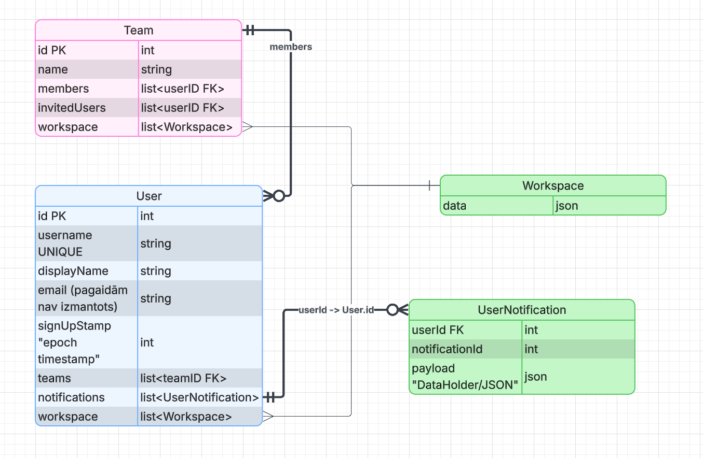

# Problēmas izpēte un analīze:  
Šī projekta atrisinātā problēma ir diezgan vienkārša: kalendāra/plānošanas lietotnes komandām ir vai nu dārgas, vai arī tās 
nenodrošina funkcijas, kuras es vēlos. Tāpēc, kad strādāju ar komandu, plānošanai parasti izmantojam tikai WhatsApp vai Discord, kas 
laika gaitā var kļūt apgrūtinoši. Tāpēc šis projekts ir tieši tas risinājums, ko esmu meklējis komandas projektiem.
Domājot par idejām šim projektam, es konsultējos ar dažiem projektu vadītājiem par to, ko viņi vēlētos šādā lietotnē.

# Programmatūras prasību specifikācija:  
Lai es būtu apmierināts ar šo projektu, man bija nepieciešamas tikai 3 lietas:
- Vienkārša komandas izveide.
- Vienkārša uzdevumu pārvaldība/uzdevumu piešķiršana.
- Minimālistisks kalendāra dizains ar papildu iestatījumiem, ja nepieciešams.

# Programmatūras projektējums:  
Lai izveidotu šo lietotni, es nolēmu izmantot Springboot (Java) backend un HeroUI (TypeScript) frontent, jo man ir liela pieredze
ar abiem frameworkiem. Sākotnēji es gribēju izmantot Rust backend, bet vairāku iemeslu dēļ nolēmu to nedarīt.
Savam datubāzes risinājumam es izmantoju DynamoDB (NoSQL), man ar to ir visērtāk strādāt. Un sanāca šāds ER modelis:
  
Lietotnes galvenās funkcijas (papildus komandas izveidei un lietotāju reģistrēšanai) ir workspace un task pārvaldība. 
Kas ir diezgan vienkārša: varat izveidot workspace komandas vai individuālas workspace ietvaros. 
Tajā varat izveidot un pārvaldīt tasks. Pilns API punktu skaidrojums ir beigās!

# Programmatūras izstrādes plāns:  
Šī projekta plānošanai es galvenokārt izmantoju savu atmiņu un intuīciju. Man bija vispārējs plāns, kas pierakstīts dokumentā, bet viss pēc tam 
tika plānots uz vietas. Kas lielākam projektam nebūtu optimāli. Tā kā lielākiem projektiem ir nepieciešama daudz lielāka savienojamība starp 
sistēmām, to plānot uz vietas ir grūtāk un laikietilpīgāk. Tāpēc es nolēmu plānot vispārēju izkārtojumu, bet ne sarežģījumus. 
Piemēram, darba vietas sistēma un tās saglabāšanas veids sākotnēji bija paredzēts citā datubāzes tabulā, bet es sapratu, ka, ja es vienkārši 
saglabātu JSON failu vecākobjektā, tas samazinātu ielādes slodzi.

# Atkļūdošanas un akcepttestēšanas pārskats:  
Šī projekta atkļūdošana bija plašs process, jo katra jaunā funkcija tika pamatīgi pārbaudīta, lai pārliecinātos, ka nav kļūdu. Dažos gadījumos 
man bija jāizveido testa gadījumi serverī (tie vēlāk tika noņemti). Testēšanai galvenokārt izmantoju iebūvēto IntelliJ atkļūdotāju, jo tas ļauj man 
pārbaudīt atmiņu un iestatīt pārtraukumpunktus. Kad programma met kļūdas, man ir mēģinājumu/noķeršanas (try/catch) kritiskās vietās, kur nepieciešama
kļūdu labošana vai ziņošana.

# Lietotāja ceļvedis:  
Ja configurē jaunu projektu  
Ir jātaisa jauns .env file, kur jābūt:  
AWS_ACCESS_KEY= atslēga  
AWS_SECRET_KEY= atslēga  
JWT_SECRET= random liels strings  
JWT_EXPIRATION=3600000  
JWT_REFRESH_EXPIRATION=86400000  

Pēc tam projekta CMD var ievadīt `.\gradlew build`, lai projekts compileojas.
Vai arī `.\gradlew bootRun`, lai testētu projektu in-ide.

# Papildus API informācija:  

Lai vieglāk saprastu nākamo sekciju, šie ir shortcuts, ko izmantošu:
- Api ("/apiVārds/?"), kur ? ir nākamas sekcijas "klausītājs"
  - "/?" - ģenerāla descripcija
    - post (ko sūta uz serveri) -> ko serveris atbild
    vai
    - get (ko serveris atbild)

Visiem publiskiem API, izņemot tiem, kas ir annotēti ar "*"
Ir jābut valid User statusam, kas tiek validēts ar accessToken

Publiskie API:
- User API ("/user/?"):
  - "/register"* - Atļauj veikt jauna User reģistrāciju 
    - post (username, displayName, password) -> statuss
  - "/login"* - Atļauj lietotājam iejiet mājaslapā
    - post (username, password) -> statuss
  - "/logout"* - Informē serveri, ka lietotājs ir izrakstijies + atjauno accessToken
    - get (accessToken)
  - "/me" - Atbild ar svarīgu informāciju par lietotāju
    - get (id, username, displayName)
  - "/teams" - Atbild ar komandu sarkastu, kurā ir lietotājs
    - get (map<id, (team) name>)
  - "/teamInvites" - Atbild ar sarakstu, kuras komandas ir ielūguši lietotāju
    - get (map<id, (team) name>)
  - "/workspaces" - Atbild ar visu workspace sarakstu
    - get (map<id, (workspace) name>)
  - "/workspace/{id}" - Atbild ar konkrētu lietotāja workspace info
    - get (id, (workspace) name)
  - "/refresh-token" - Atbild ar jaunu accessToken
    - post (refreshToken) -> accessToken
    
- Team API ("/team/?")
  - "/register" - Atļauj lietotājam reģistrēt jaunu komandu
    - post (name) -> statuss
  - "/{teamID}" - Atbild ar komandas informāciju
    - get (id, name, list<(User displayName) string>)
  - "/{teamID}/join" - Atļauj User pievienoties komandai (ja ir ielūgums)
    - get (statuss)
  - "/{teamID}/invite" - Atļauj User taisīt ielūgumu citam
    - post (username) -> statuss

- Workspace API ("/workspace/?")
  - "/create" - Atļauj taisīt jaunu workspace komandai, vai lietotājam
    - post (name, teamID) -> statuss
  - "/{id}/createEvent" - Uztaisa jaunu tukšu kalendāra event 
    - get (statuss)
  - "/{id}/updateEvent" - Pārmaina event informāciju
    - post (id, title, description, setDate, dueDate, list<attendees>) -> statuss
  - "/{id}/events" - Atbild ar visiem workspace events
    - get (list<id, event>)

Ir plāni taisīt "private" api, kur admin users var rediģēt users, teams, uttl. bez iešanas uz datubāzes
Bet tie ir nākotnes plāni!

Paldies par uzmanību!! 
--Renars
